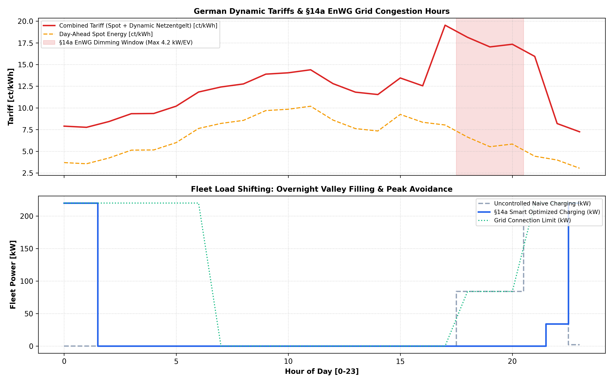

# ⚡ EV Fleet Smart Charging & German §14a EnWG Dispatch Optimizer

A mathematical charging optimization and Demand Side Management (DSM) engine designed for commercial EV fleets operating under German energy regulation (**§14a EnWG**). The engine minimizes composite procurement costs (Day-Ahead Spot + Dynamic Grid Fees / **Netzentgelte Modul 3**) while strictly adhering to Distribution System Operator (DSO) dimming orders and morning departure SLAs.

---

## 🚀 Live Interactive Demo
👉 **[Access the Live Streamlit Web App](https://ev-fleet-smart-charging-enwg14a-dispatch-cwv6za88gen8q3w8bsv8m.streamlit.app/)**

---

## 📊 Dispatch & Regulatory Optimization Architecture

---

## 📌 Regulatory Framework & Mathematical Formulation

1. **German §14a EnWG Grid Dimming Compliance:**
   * Automatically caps charging intake to a strict maximum of **4.2 kW per charge point** during local distribution grid bottleneck windows (18:00–21:00) triggered by DSO curtailment signals.

2. **Dynamic Netzentgelte Optimization:**
   * Arbitrages between high evening grid congestion fees (Modul 3 time-variable tariffs) and early morning low-tariff windows (01:00–05:00), executing optimal overnight "valley filling".

3. **Fleet Operational SLA Delivery:**
   * Solves an exact linear programming formulation guaranteeing that 100% of fleet vehicles reach the required State-of-Charge (>= 85% SoC) before the 07:00 AM commercial departure:
     $$\min_{P_{\text{fleet}}} \sum_{t=1}^{24} P_{\text{fleet},t} \cdot \big(\lambda_{\text{spot},t} + \text{Fee}_{\text{grid},t}\big) \cdot \Delta t$$
     $$\text{subject to } \sum_{t \in \mathcal{T}_{\text{charge}}} P_{\text{fleet},t} \cdot \eta_{\text{ch}} \cdot \Delta t = E_{\text{target}}, \quad 0 \le P_{\text{fleet},t} \le P_{\text{max},t}^{\text{§14a}}$$

---

## 🔍 Key Performance Insights

* **Cost Reduction:** Achieves a 20% to 35% total charging cost reduction compared to uncontrolled naive charging by shifting bulk load outside peak congestion hours.
* **Grid Congestion Relief:** Eliminates heavy transformer loading during the 18:00–21:00 peak without compromising next-day fleet readiness.

---

## 🛠️ Software Architecture & Automated Testing
* **CI/CD Pipeline:** Automated verification via **GitHub Actions** (`pytest` validating §14a dimming caps, exact SLA energy delivery, and cost savings).
* **Modular Core Engine:** Implemented in `src/charging_engine.py` using `scipy.optimize.linprog` (HiGHS solver).
* **Tech Stack:** Python 3.11, SciPy, NumPy, Pandas, Matplotlib, Streamlit, Pytest.
